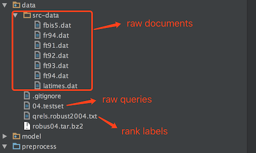

# Standalone Neural Ranking Model (SNRM)
/** Copyright (C) 2018 by Center for Intelligent Information Retrieval / University of Massachusetts Amherst.

The package of SNRM is distributed for research purpose, but WITHOUT ANY WARRANTY; without even the implied warranty of MERCHANTABILITY or FITNESS FOR A PARTICULAR PURPOSE. **/

# Introduction
SNRM [1] is the first learning to rank model that instead of "re-ranking" a few items (e.g., documents) is able to rank documents from a large collection of items. SNRM is a pairwise neural ranking model implemented for the ad-hoc retrieval task.

The main idea behind SNRM is to learn a high-dimensional sparse representation for each query or document in order to make inverted index construction possible. Then, an inverted index is constructed from the learned sparse representations, which is used for efficient retrieval. Therefore, SNRM does not need a first stage retrieval and can retrieve items (documents) from a large collection. 

The original SNRM model [1] is trained using weak supervision [2]. The weak supervision signal was computed using the query likelihood retrieval model. Since the weak supervision data is huge (hundreds of gigabytes), we cannot share the data. If you want to use the code, you should implement your own 'generate_batch' method that returns a batch of pairwise training data (query. document1, document2, label). For inverted index construction, you should also implement your own 'generate_batch' method that simply returns a batch of document ID and their content.

If you find this model useful, you may want to cite the SNRM paper published at CIKM '18 [1].


[1] Hamed Zamani, Mostafa Dehghani, W. Bruce Croft, Erik Learned-Miller, and Jaap Kamps. "From Neural Re-Ranking to Neural Ranking: Learning a Sparse Representation for Inverted Indexing", In Proc. of CIKM 2018.

[2] Mostafa Dehghani, Hamed Zamani, Aliaksei Severyn, Jaap Kamps, and W. Bruce Croft. "Neural Ranking Models with Weak Supervision", In Proc. of SIGIR 2017.

# Author
This project was implemented by [Hamed Zamani](http://hamedz.ir/) of the [Center for Intelligent Information Retrieval (CIIR)](http://ciir.cs.umass.edu/) at the University of Massachusetts Amherst. If you have any comment or question, please do not hesitate to contact the author via <zamani@cs.umass.edu>.


# My Experiment on Robust2004
## Environment
- Python3.6
- TensorFlow-1.11
- Machine: 20CPU + 128G Ram

## Data Preprocessing
### My Robust04 Data


### 1. parse document and query into mongodb
```bash
cd preprocess
python3 parse_documents.py
python3 parse_query.py
```
### 2. tokenize
tokenize based on the dictionary of Glove.
```bash
python3 extract_word_list.py
python3 doc_tokenize.py
```

### 3. use ElasticSearch to generate query likelihood score
```bash
python3 create_index_by_elasticsearch.py
python3 test_search.py
```

### 4. create pairwise data
```bash
python3 create_pairwise_data.py
```

## Training
```bash
cd code
export CUDA_VISIBLE_DEVICES=1   # my gpu config
python3 train.py 
```

## Inverted Index Construction
```bash
cd code
python3 index_construction.py 
```

## Evaluation
### 1. Retrieval
```bash
cd code
python3 retrieval.py
```
